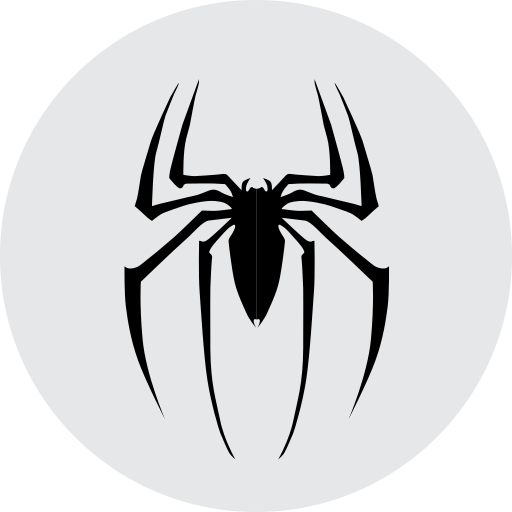
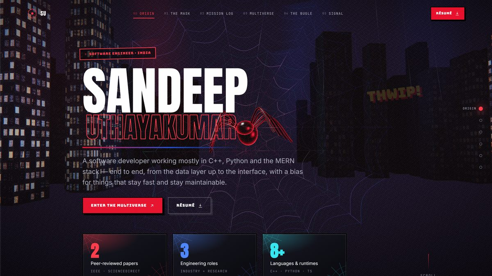
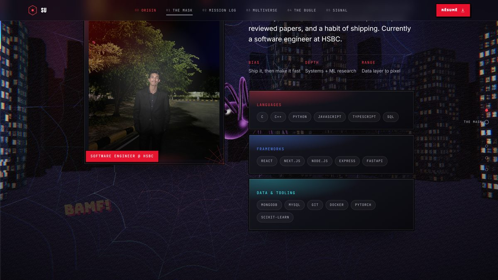
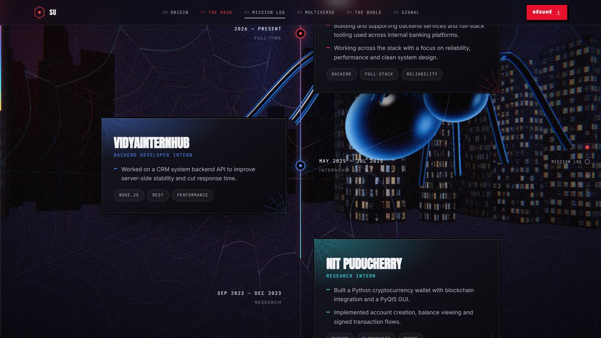
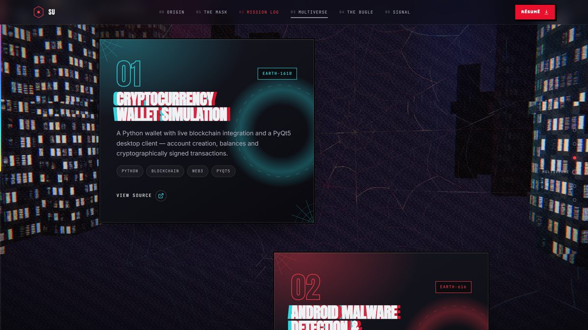
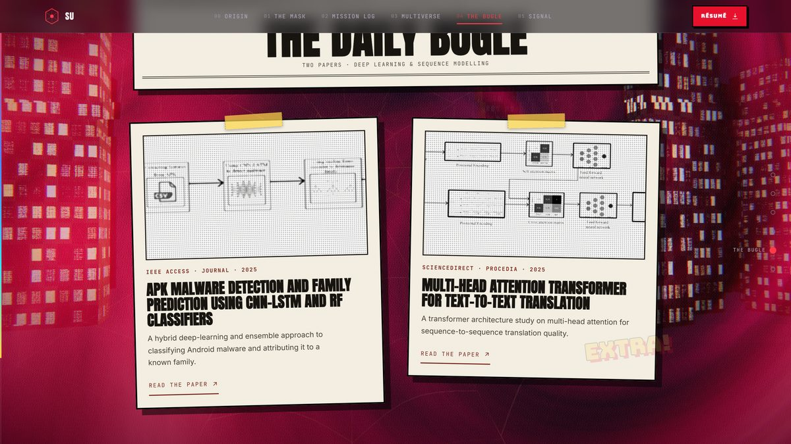
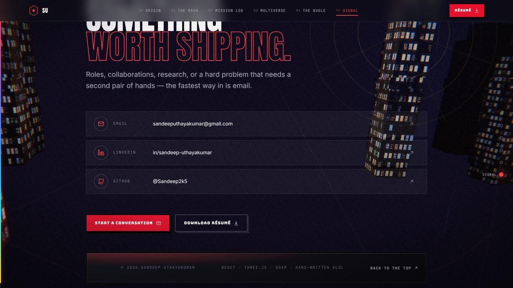

# SANDEEP UTHAYAKUMAR — PORTFOLIO

### Not a page. A flight through a city.

### [→ sandeep2k5.netlify.app](https://sandeep2k5.netlify.app/)

---

---

## The idea

Most developer portfolios are a stack of cards on a dark background. This one
asks a harder question: **what if the page and the 3D world were literally the
same journey?**

There is exactly one scene, mounted once, alive for the whole session.
Scrolling is not a page transition — it is camera travel along a Catmull-Rom
spline through a canyon of procedurally-lit towers. Each of the six chapters is
a keyframe on that spline with its own camera position, look-at target and
accent colour. The DOM scrolls, the camera flies, and the two stay in sync.

The visual language is Spider-Verse — halftone dots, chromatic aberration,
comic slats, onomatopoeia, newsprint. Not as decoration, as structure.
Six issues, one story.

---

## 01 · The Mask

Who's behind it, and the stack he builds with. The portrait is a real 3D
object — pointer position drives `rotateX`/`rotateY` on a `preserve-3d` stack
with parallax layers, not a CSS background trick.

## 02 · Mission Log

Experience, hung on a silk spine that draws itself as the scroll passes it.

## 03 · Multiverse

Every project is a comic cover suspended in front of its own dimensional rift.
The whole stack tilts with the pointer.

## 04 · The Bugle

Peer-reviewed research, set as newsprint — the one light surface in the entire
site, paper stock lifted off the dark city.

## 05 · Signal

The camera has risen above the skyline. What's left is the spider-signal thrown
at the clouds, and three ways to reach me.

---
